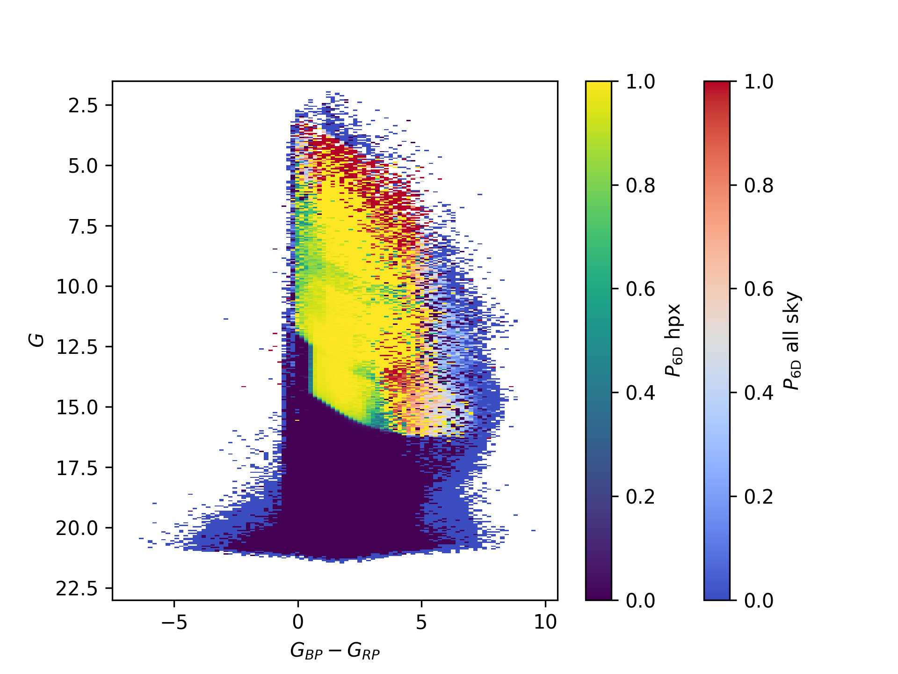

# Completeness-Mask
Completeness estimates for Radial Velocity (RVS) in the IAC project for the study of galactic fomation

Inside of the source/ folder:

- complete_mask.py: File containing all necesary (and some extra functions). 
To read and assign probabilites copy and paste 'sixd_prob_funct_aio' (aio stands for "all in one").

- generate.py: minimal code to generate a 'fits' file containing the mask

- test.py: Many tests to check that everything is working

An example of plotted mask:

  

The probability is computed as the ratio (stars with radial vel)/(all stars) with a quality cut of d<=3.5 kpc.
The domain of the probability matrix is included in the header of the fits file for the
magnitude-color-space (in healpxs). If no value is found in a certain direction (a given healpx), then
the value is chosen from an all-sky mask, when this mask does not contain information, a 0 is assigned.

Further explanation (spanish) <a href="PDF/Resumen.pdf" class="image fit">here</a>
